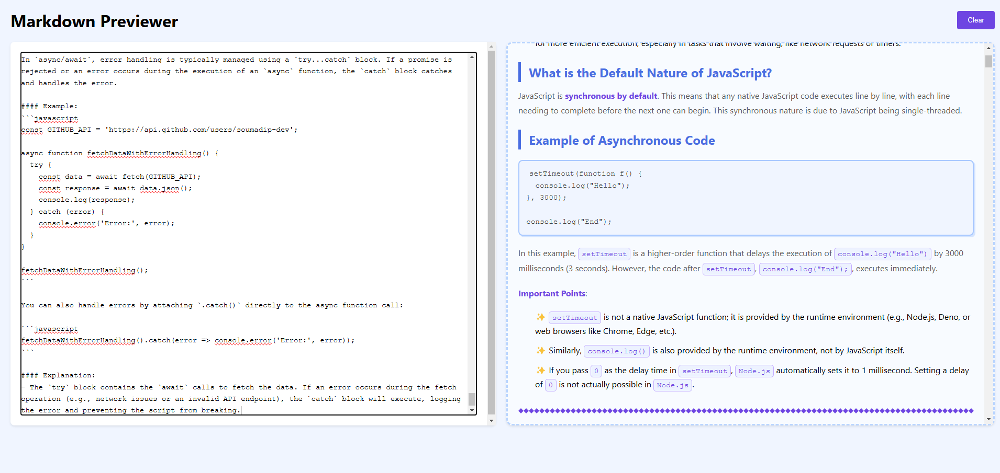

# ✍️ Markdown Previewer  

A real-time Markdown editor with live preview.  

---

## 📸 Preview  

  

  

---

## 🚀 Features  

- **Live Preview** – Instantly renders Markdown as you type.  
- **Auto-Save** – Content is automatically saved in your browser (LocalStorage).  
- **Easy Reset** – Clear the editor with a single click.  
- **Responsive Design** – Works seamlessly on both desktop and mobile.  

---

## ⚙️ Technical Details  

- Built with **HTML, CSS, and JavaScript**.  
- Uses **[Marked.js](https://marked.js.org/)** for Markdown parsing.  
- Utilizes **LocalStorage** for saving content.  

---
