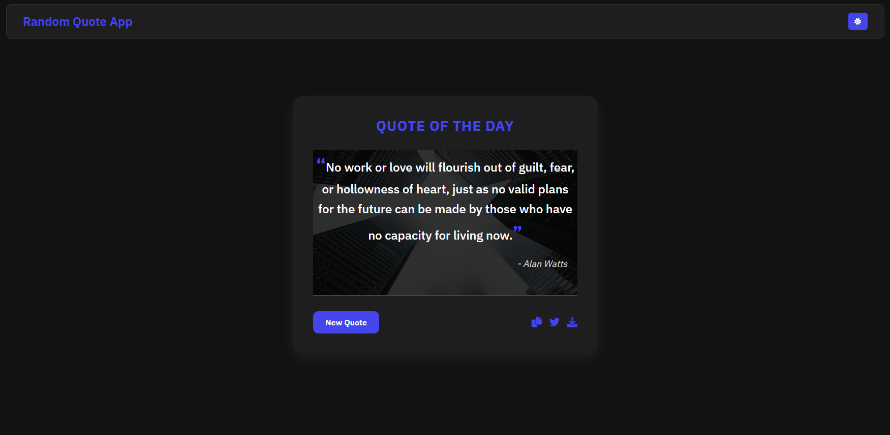

<h1 align="center">
  <br>
  Random Quote Generator
  <br>
</h1>

<div align="center">
  <a href="https://github.com/soumadip-dev">
    
  </a>
</div>

<h3 align="center">
  A simple JS app that fetches and displays random quotes with sharing and export options. 
</h3>

---

## 📸 Preview

<div align="center">
  
</div>

---

## 🚀 Features

- **Random Quote Generation**: Fetches and displays a new random quote with each click.
- **Dark/Light Mode**: Toggle between dark and light themes for better readability.
- **Copy to Clipboard**: Easily copy the quote to your clipboard.
- **Share on Twitter**: Share your favorite quotes directly on Twitter.
- **Export as Image**: Download the quote as an image to save or share.
- **Responsive Design**: Fully responsive and works seamlessly on all devices.

---

## 🛠️ Installation

Clone the repository:

```bash
git clone https://github.com/soumadip-dev/Random-Quote-Generator-JS.git
cd Random-Quote-Generator-JS
```
---