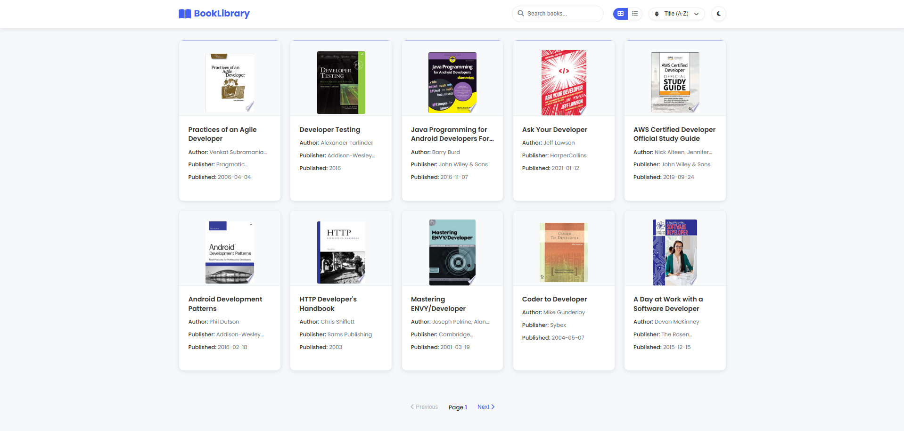
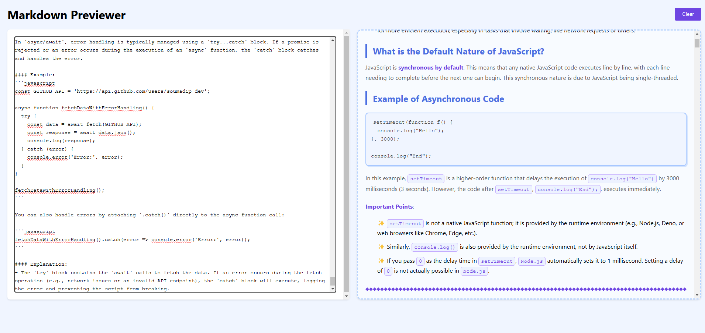

<h1 align="center">
  <br>
  Intermediate-Projects-JS
  <br>
</h1>

<div align="center">
  <a href="https://github.com/soumadip-dev">
    
  </a>
</div>

<h3 align="center" style="margin: 20px 0;">
  A collection of intermediate-level JavaScript projects to enhance coding skills and demonstrate various programming concepts.
</h3>

---

## 📦 Projects

<div align="center">

|                                                                                                                                                                                                                   |                                                                                                                                                                                                                   |
| :---------------------------------------------------------------------------------------------------------------------------------------------------------------------------------------------------------------: | :---------------------------------------------------------------------------------------------------------------------------------------------------------------------------------------------------------------: |
| <div align="center"><br>📚 **[Book Listing Application](./Book-Library-App/)**<br>View, search, and sort books using a public API.<br><br></div> | <div align="center"><br>📝 **[Markdown Previewer]()**<br>Real-time Markdown editor with live preview.<br><br></div> |
| <div align="center"><br>💬 **[Random Quote Generator](https://github.com/soumadip-dev/Intermediate-Projects-JS/tree/main/Random_Quote_Generator)**<br>Generate and share quotes with various export options.<br><br></div> |  

</div>

---

## 🛠️ Installation  

```bash
git clone https://github.com/soumadip-dev/Intermediate-Projects-JS.git
cd Intermediate-Projects-JS
