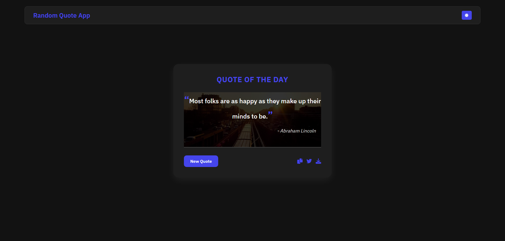

# 📝 Random Quote Generator

A simple JavaScript app that fetches and displays random quotes with sharing and export options.

---

## 📸 Preview

  

---

## 🚀 Features

- **Random Quote Generation** – Fetches and displays a new random quote with each click.
- **Dark/Light Mode** – Toggle between dark and light themes for better readability.
- **Copy to Clipboard** – Easily copy quotes with a single click.
- **Share on Twitter** – Instantly share your favorite quotes on Twitter.
- **Export as Image** – Download quotes as an image for easy saving or sharing.
- **Responsive Design** – Works seamlessly on all devices.

---
