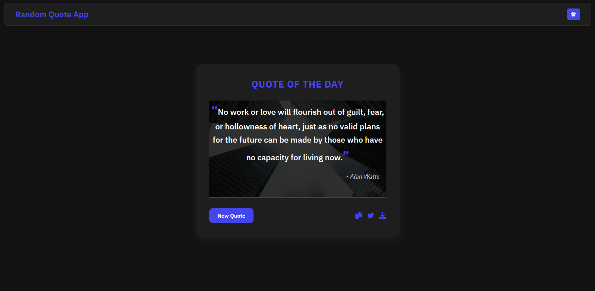

<h1>
  Random Quote Generator
</h1>

A simple JS app that fetches and displays random quotes with sharing and export options.

---

## 📸 Preview

  

---

## 🚀 Features

- **Random Quote Generation**: Fetches and displays a new random quote with each click.
- **Dark/Light Mode**: Toggle between dark and light themes for better readability.
- **Copy to Clipboard**: Easily copy the quote to your clipboard.
- **Share on Twitter**: Share your favorite quotes directly on Twitter.
- **Export as Image**: Download the quote as an image to save or share.
- **Responsive Design**: Fully responsive and works seamlessly on all devices.

---
